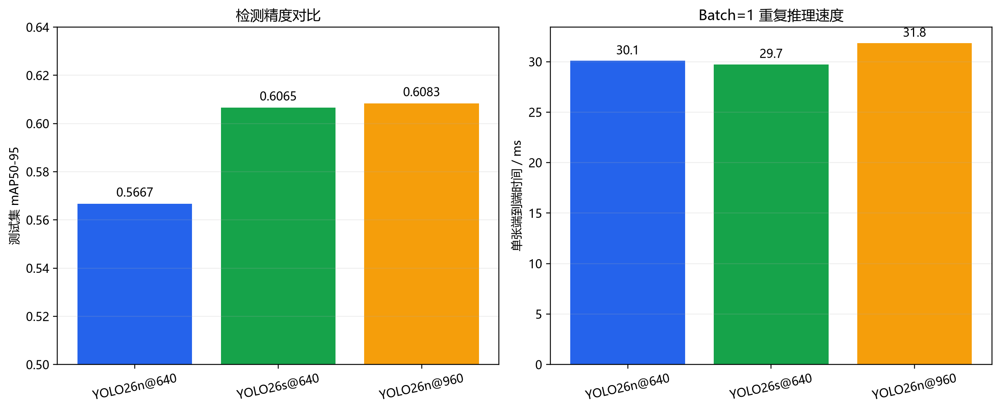

# 模型改进与消融实验

## 实验设计

基线错误分析表明，主要问题是阅读、转头和抬头听讲之间的细粒度语义混淆，小目标召回率并未明显低于中、大目标。基于这一证据设置两组控制变量实验：

1. `YOLO26s@640`：保持输入和训练流程不变，只提高模型容量。
2. `YOLO26n@960`：保持模型规模不变，只把输入尺寸从640提高到960。

三组实验使用相同数据划分、随机种子42、100轮上限、patience=20、AMP和独立测试集。n@640与s@640使用batch=16；n@960因像素量增加使用batch=8。

## 训练结果

| 实验 | 实际轮数 | 最佳轮次 | 训练时间/s | 峰值已分配显存/GiB | 验证mAP50 | 验证mAP50-95 |
|---|---:|---:|---:|---:|---:|---:|
| YOLO26n@640 | 89 | 69 | 278.45 | 2.70 | 0.7860 | 0.5754 |
| YOLO26s@640 | 66 | 46 | 285.76 | 4.78 | 0.8414 | 0.6223 |
| YOLO26n@960 | 100 | 95 | 532.83 | 3.10 | 0.8150 | 0.6078 |

提高模型容量和提高输入分辨率都改善了验证指标。s@640以接近基线的总训练时间取得最高验证mAP50-95；n@960训练时间约为基线的1.91倍。

## 独立测试集总体对比

| 实验 | Precision | Recall | mAP50 | mAP50-95 | 相对基线mAP50-95 |
|---|---:|---:|---:|---:|---:|
| YOLO26n@640 | 0.6944 | 0.7796 | 0.7711 | 0.5667 | - |
| YOLO26s@640 | 0.7373 | 0.7926 | 0.8221 | 0.6065 | +0.0399 |
| YOLO26n@960 | 0.7798 | 0.7669 | 0.8257 | 0.6083 | +0.0417 |

两种方案都将测试mAP50-95提高约4个百分点。n@960总体指标最高，但仅比s@640高0.0018，这一差距远小于不同随机种子和少数类小样本可能带来的波动，不能解释为显著领先。

## 各类别AP50-95对比

| 类别 | n@640 | s@640 | n@960 | s@640相对基线 | n@960相对基线 |
|---|---:|---:|---:|---:|---:|
| 书写 | 0.5893 | 0.6445 | 0.6074 | +0.0553 | +0.0181 |
| 阅读 | 0.3883 | 0.4681 | 0.4401 | +0.0798 | +0.0519 |
| 抬头听讲 | 0.6044 | 0.6464 | 0.6268 | +0.0420 | +0.0225 |
| 转头 | 0.4405 | 0.5454 | 0.5337 | +0.1049 | +0.0932 |
| 举手 | 0.5466 | 0.6425 | 0.5992 | +0.0959 | +0.0526 |
| 站立 | 0.6531 | 0.5506 | 0.6805 | -0.1024 | +0.0274 |
| 讨论 | 0.7446 | 0.7483 | 0.7705 | +0.0037 | +0.0259 |

YOLO26s对错误分析中最弱的阅读和转头分别提升0.0798和0.1049，优于提高分辨率方案，支持“模型表征能力是主要瓶颈”的判断。s@640的站立AP下降，但测试集只有9个站立框，单个预测变化即可造成较大波动，不能据此对模型整体能力做强结论。

## 模型复杂度与速度

| 实验 | 参数量 | 估算GFLOPs | 权重/MB | Batch=1模型推理/ms | Batch=1端到端/ms |
|---|---:|---:|---:|---:|---:|
| YOLO26n@640 | 2,376,201 | 5.2 | 5.12 | 6.31 | 30.08 |
| YOLO26s@640 | 9,467,889 | 20.5 | 19.36 | 6.96 | 29.73 |
| YOLO26n@960 | 2,376,201 | 约11.7 | 5.16 | 7.09 | 31.83 |

速度使用同一测试图片、batch=1、预热10次后重复50次测得。端到端时间包含图片输入与Ultralytics调用开销，绝对值会受磁盘缓存和系统状态影响，主要用于同机相对比较。RTX 3080对三种轻量配置都能实时运行，模型推理时间差距较小；但s模型权重约为n模型的3.8倍。

## 最终模型选择

建议系统默认使用 `YOLO26s@640`：

1. 它针对错误分析确认的弱项取得更明显提升，阅读、转头和举手AP改善最大。
2. 测试mAP50-95与最高的n@960仅差0.0018，可视为基本持平。
3. 标准640输入减少视频缩放和处理开销，端到端测速略优于n@960。
4. RTX 3080显存足够，19.36MB权重和约4.78GiB训练峰值可接受。

YOLO26n@640仍保留为轻量部署选项；若将来需要低存储占用，可牺牲约0.04的mAP50-95换取更小模型。n@960证明提高分辨率有效，但训练时间更长，且对核心弱项的改善不及s@640，因此不作为默认系统模型。

## 实验结论

模型容量和输入分辨率均能提升课堂行为检测效果。实验结果支持从错误分析出发进行改进：对于视觉尺度并非主要瓶颈、但细粒度类别混淆明显的任务，适度提升模型容量比单纯提高输入分辨率更符合精度、训练成本和系统应用之间的平衡。
