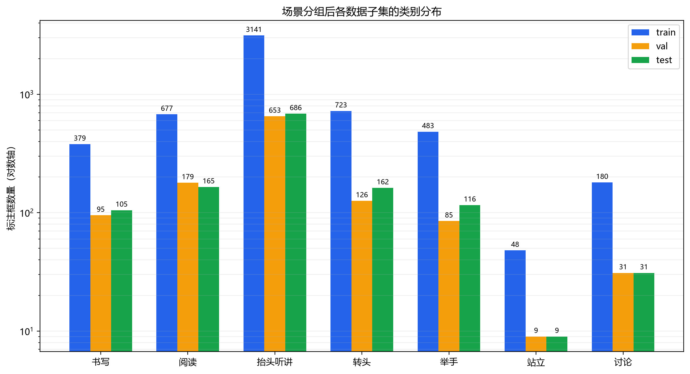

# SCBehavior 场景感知数据划分方法

## 划分目标

上游数据的训练集和验证集包含大量高度相似课堂画面，直接沿用可能造成验证指标虚高。本项目重新合并全部400张图片，再按视觉场景组划分为训练集、验证集和测试集。目标比例为70%/15%/15%，并要求7类行为在三个子集中都有覆盖。

## 场景特征与聚类

1. 使用 torchvision 提供的 ImageNet 预训练 ResNet18。
2. 移除最终分类层，提取每张完整课堂图片的512维特征。
3. 对特征进行 L2 归一化，以余弦距离衡量视觉场景相似度。
4. 使用单链接层次聚类，距离阈值设为0.01。
5. 任意余弦距离不超过0.01的图片通过连通关系归入同一场景组。

该方法得到323个场景组，最大组包含35张图片。划分时以场景组为不可拆分单位，从而避免最相似的连续或近连续画面跨越训练、验证和测试集。

## 分组分配

使用固定随机种子42进行50000次候选分配，在满足以下约束的方案中选择图片比例与类别比例误差最小者：

- 三个子集均非空；
- 训练/验证/测试目标比例为70%/15%/15%；
- 7个类别在三个子集中均有标注；
- 验证集和测试集各至少包含5个站立标注框；
- 验证集和测试集各至少包含10个讨论标注框。

## 最终划分

| 子集 | 图片 | 场景组 | 标注框 | 图片占比 |
|---|---:|---:|---:|---:|
| 训练集 | 281 | 221 | 5631 | 70.25% |
| 验证集 | 59 | 50 | 1178 | 14.75% |
| 测试集 | 60 | 52 | 1274 | 15.00% |

| 类别 | 训练集 | 验证集 | 测试集 |
|---|---:|---:|---:|
| 书写 | 379 | 95 | 105 |
| 阅读 | 677 | 179 | 165 |
| 抬头听讲 | 3141 | 653 | 686 |
| 转头 | 723 | 126 | 162 |
| 举手 | 483 | 85 | 116 |
| 站立 | 48 | 9 | 9 |
| 讨论 | 180 | 31 | 31 |

## 泄漏检查

重新计算所有跨子集图片对的 ResNet18 余弦距离，距离不超过0.01的跨子集图片对数量为0；最小跨子集余弦距离约为0.0100435。所有400张图片均有且仅有一个对应标签，标签格式与类别ID再次验证通过。

需要说明的是，该方法隔离的是近似连续帧和极高相似场景，并不能让训练、验证和测试集使用完全不同的教室背景。若按完整教室环境严格隔离，讨论行为几乎集中在单一环境中，将无法在三套数据中进行有效评价。当前方案是在防止近重复泄漏和保留少数类可评估性之间的折中。

## 可复现文件

- `data/splits/scbehavior_manifest.csv`：每张图片的原始划分、场景组和目标划分。
- `docs/statistics/scbehavior_split_summary.json`：聚类参数、随机种子和最终统计。
- `data/processed/SCBehavior/data.yaml`：Ultralytics YOLO 数据配置。
- `data/interim/SCBehavior/scene_embeddings.npy`：与清单顺序对应的场景特征缓存。

